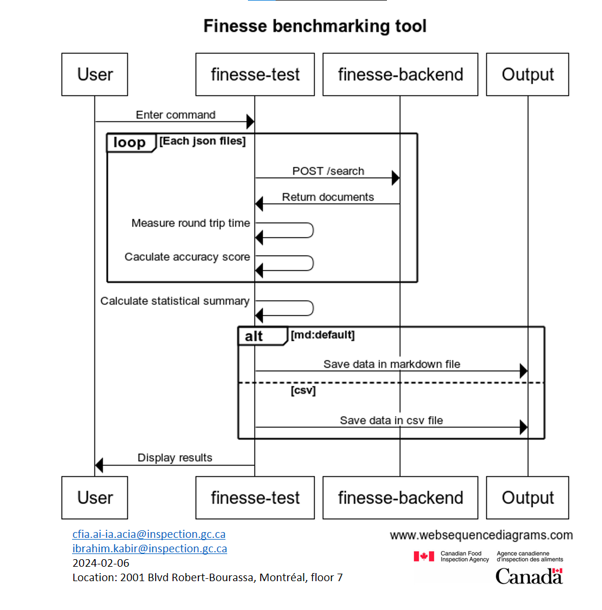

# Design of the Finesse Benchmark Tool

This tool simplifies the process of comparing different search engines and
assessing their accuracy. It's designed to be straightforward, making it easy
to understand and use.

## How it Works

- **Single command:**
  - Users can enter commands with clear instructions to choose a search engine,
    specify a directory for JSON files and specify the backend URL.
  - Mandatory arguments:
    - `--engine [search engine]`: Pick a search engine.
      - `ai-lab` : AI-Lab search engine
      - `azure`: Azure search engine
      - `static`: Static search engine
      - `llamaindex`: LlamaIndex search engine
    - `--path [directory path]`: Point to the directory with files structured
    - `--host [API URL]`: Point to the finesse-backend URL
      with JSON files with the following properties:
      - `score`: The score of the page.
      - `crawl_id`: The unique identifier associated with the crawl table.
      - `chunk_id`: The unique identifier of the chunk.
      - `title`: The title of the page.
      - `url`: The URL of the page.
      - `text_content`: The main textual content of the item.
      - `question`: The question to ask.
      - `answer`: The response to the asked question.
  - Optional argument:
    - `--format [file type]`:
      - `csv`: Generate a CSV document
      - `md`: Generate a Markdown document, selected by default
    - `--once`: Go through all the json files and does not repeat
    - `--top`: Limit the number of results returned by the search engine
- **Many tests**
  - Test all the JSON files in the path directory
- **Accuracy score**
  - The tool compares the expected page with the actual Finesse response pages.
  - Calculates an accuracy score for each response based on its position in the
    list of pages relative to the total number of pages in the list. 100% would
    correspond of being at the top of the list, and 0% would mean not in the
    list.
- **Round trip time**
  - Measure round trip time of each request
- **Summary statistical value**
  - Measure the average, median, standard deviation, minimum and maximal accuracy scores and round trip time

## Diagram



## Example Command

```cmd
$locust -f finesse/finesse_test.py --engine azure --path finesse/QnA/good_question --host https://finesse-guidance.ninebasetwo.xyz/api --once
Searching with Azure Search...

File: qna_2023-12-08_36.json
Question: Quelle est la zone réglementée dans la ville de Vancouver à partir du 19 mars 2022?
Expected URL: https://inspection.canada.ca/protection-des-vegetaux/especes-envahissantes/directives/date/d-96-15/fra/1323854808025/1323854941807
Accuracy Score: 50.0%
Time: 277.836ms

File: qna_2023-12-08_19.json
Question: What are the requirements for inspections of fishing vessels?
Expected URL: https://inspection.canada.ca/importing-food-plants-or-animals/food-imports/foreign-systems/audits/report-of-a-virtual-assessment-of-spain/eng/1661449231959/1661449232916
Accuracy Score: 0.0%
Time: 677.906ms

...

---
Tested on 21 files.
Time statistical summary:
  Mean:429, Median:400, Standard Deviation:150  Maximum:889, Minimum:208
Accuracy statistical summary:
  Mean:0.35, Median:0.0, Standard Deviation:0.25, Maximum:1.0, Minimum:0.0
---
```

This example shows how the CLI Output of the tool, analyzing search results from
Azure Search and providing an accuracy score for Finesse.
